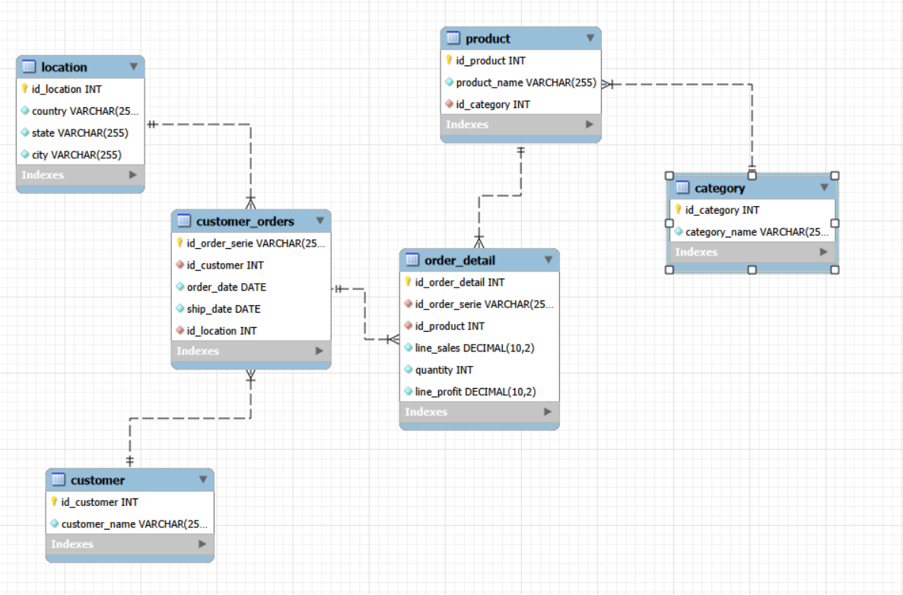

# 
**Walmart Sales Data Modeling with MySQL**

This project includes ETL with Python, data modeling with SQL, and data analytics and visualization with Power BI.

## **Objective**
Este proyecto de análisis de ventas de Walmart implementa un flujo completo de datos utilizando Python, MySQL y Power BI. El proceso abarca la fase ETL, el modelado relacional y la visualización final para la toma de decisiones estratégicas.

## **Dataset**

| Variable | Descripción |
| --- | --- |
| Order ID | Identificador de la orden |
| Order Date | Fecha de compra |
| Ship Date | Fecha de envío |
| Customer Name | Cliente |
| State | Estado |
| City | Ciudad |
| Category | Categoría |
| Product Name | Producto |
| Sales | Venta |
| Quantity | Cantidad |
| Profit | Ganancia |

## **Technologies used**
| Stack | Technology | Purpose |
| :---: | :--- | :--- |
| 🐍 | **Python** | Core Language |
| 🐼 | **Pandas** | Data Manipulation |
| 🔢 | **NumPy** | Mathematical Computing |
| 🛢️ | **My SQL** | Data Loading |
| 📊 | **Structured Query Language (SQL)** | Data Modeling |
| 🪐 | **Power BI** | Data Visualization |

## **Project workflow**

## **ETL**
* ### **Data Inspection**
Data types  
Missing values  
Duplicate rows  
Statistical summary  
* ### **Data Cleaning**
Date conversion  
Standardized column names  
Removed inconsistencies  
* ### **Data Validation**
✔️ Verified that every product belongs to a single category.  
✔️ Verified that every city belongs to the correct state.  
✔️ Corrected inconsistent product categorization (Staples).  
✔️ Created a new Location feature to uniquely identify cities. 
* ## **Data Modeling in MySQL**
Once the ETL process with Python is complete, the "walmart schema.sql" file is created, which will contain all the tables proposed for our data model. These tables are: 

**sales_raw:** This table is created to store the data exactly as it appears in our "walmart_sales_cleaned.csv" file.  

**Customer:** This contains the customer's name and a unique identification ID.  

**Category:** This contains the product category and a unique identifier ID.  

**Location:** This contains the customer's country, state and city as well as a unique identifier. 

**Product:** This contains the product name and the ID of the category it belongs to; the latter is declared as a foreign key referencing the "category" table. 

**Customer_orders:** This table stores each order only once, even if the original record is repeated because a single order includes several products from different categories. The structure includes the creation date, the shipping date, the customer ID, and the location ID (both are foreign keys that connect to the "customer" and "location" tables). 

**Order_detail:** This table contains the order series ID, which links it to the previous table; it also contains the product ID, which links it to the "Product" table; and it contains sales, quantity, and profit. 

The code for the process of loading the data into the aforementioned tables is located in the file "**walmart_LoadData.sql**"

* ### **Business Questions**
Which category generates the highest sales? 
Which states contribute the most revenue? 
What is the monthly sales trend? 
Which customers generate the highest revenue? 
Which product category generates the highest profitability? 

* ### **Key Insights**
Copiers represents the highest sales category. 
Furniture has high revenue but lower profit margins. 
Sales increase significantly during the last quarter of the year. 
A small group of customers contributes disproportionately to total revenue. 

* ### **Autor**

Nombre: Monserrat Castillo

GitHub: mcastillogomes88-del

Correo: m.castillogomes88@gmail.com

